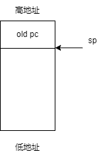
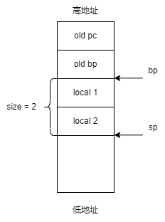

## save & load

包括： `IMM, LEA, LC, LI, SC, SI, PUSH`

```cpp
// save & load

// format: IMM [num]
// example: IMM 2. 将 2 赋给 ax
if (op == IMM)          ax = *pc++;

// format: LEA [num]
// example: LEA 2. 将 bp+2 的地址赋给 ax
else if (op == LEA)     ax = (int)(bp + *pc++);

// format: LC
// 将 ax 中保存的值视为一个地址，将保存在这个地址的一个 char 保存到 ax 中
// 具体实现: 将 ax 中的值转为一个 char* 指针, 然后取出这个指针所指向的 char
else if (op == LC)      ax = *(char*)ax;
// format: LI
// 与 LC 类似
else if (op == LI)      ax = *(int*)ax;

// format: SC
// 将栈顶所保存的值视为一个 char* 指针, 将 ax 的值保存到该指针所指向的空间
else if (op == SC)      *(char*)*sp++ = ax;
// format: SI
// 与 SC 类似
else if (op == SI)      *(int*)*sp++ = ax;

// format: PUSH
else if (op == PUSH)    *--sp = ax;
```

## 算术运算、位运算、逻辑运算

包括：`ADD, SUB, MUL, DIV, MOD, OR, XOR, AND, SHL, SHR, IQ, NE, LT, LE, GT, GE`

```cpp
// basic: ax = *sp++ op ax
else if (op == OR)      ax = *sp++ |  ax;
else if (op == XOR)     ax = *sp++ ^  ax;
else if (op == AND)     ax = *sp++ &  ax;
else if (op == EQ)      ax = *sp++ == ax;
else if (op == NE)      ax = *sp++ != ax;
else if (op == LT)      ax = *sp++ <  ax;
else if (op == LE)      ax = *sp++ <= ax;
else if (op == GT)      ax = *sp++ >  ax;
else if (op == GE)      ax = *sp++ >= ax;
else if (op == SHL)     ax = *sp++ << ax;
else if (op == SHR)     ax = *sp++ >> ax;
else if (op == ADD)     ax = *sp++ +  ax;
else if (op == SUB)     ax = *sp++ -  ax;
else if (op == MUL)     ax = *sp++ *  ax;
else if (op == DIV)     ax = *sp++ /  ax;
else if (op == MOD)     ax = *sp++ %  ax;
```

## 分支跳转

包括：`JMP, JZ, JNZ, CALL, NVAR, DARG, RET`

`JMP` 是直接修改 `pc` 寄存器，`JZ, JNZ` 在 `JMP` 之前会先判断 `ax` 是否等于 0。

```cpp
// format: JMP/JZ/JNZ address
```

* `CALL`
  格式：`CALL [address]`
  先将 `pc` 入栈，然后将其修改为 `[address]`。
  栈图：（old pc 上面是函数的参数，即 `[arg1], [arg2], [old pc]`）

  
* `NVAR`
  格式：`NVAR [size]`

  先将 `bp` 入栈，然后令 `bp` 指向当前栈顶（即保存旧 `bp` 的地址），然后开拓 `[size]` 大小的栈空间给局部变量。

  栈图：

  
* `DARG`

  格式：`DARG [size]`

  简单地把 `sp` 加 `[size]`，用于收回分配给局部变量的栈空间。
* `RET`

  格式：`RET`

  先令 `sp = bp`，然后取出栈顶的 `old bp` 赋给 `bp`，再取出栈顶的 `old pc` 赋给 `pc`。

## Native Call

包括：`OPEN, CLOS, READ, PRTF, MALC, FREE, MSET, MCMP, EXIT`
